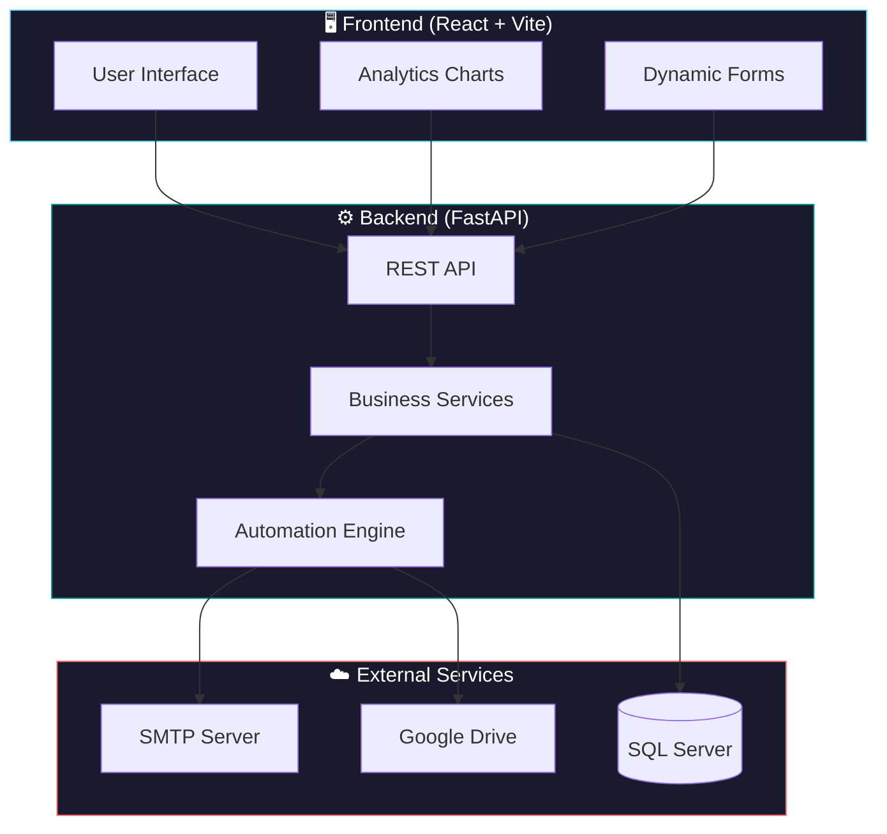
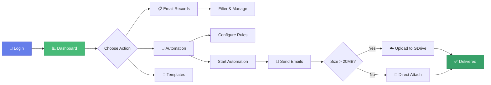

<div align="center">

# 📧 EmailManagement

### *Streamline Your Email Workflows with Intelligent Automation*

[](https://python.org)
[](https://reactjs.org)
[](https://fastapi.tiangolo.com)
[](https://www.microsoft.com/sql-server)
[](LICENSE)

<br>

[🚀 Quick Start](#-quick-start) •
[✨ Features](#-features) •
[📖 Documentation](#-documentation) •
[🔧 Configuration](#-configuration) •
[🤝 Contributing](CONTRIBUTING.md)

<br>

---

</div>

## 🎯 Overview

**EmailManagement** is a comprehensive full-stack application designed to automate and streamline the process of sending emails with attachments to clients. It seamlessly integrates with SQL Server databases, manages email templates, tracks delivery status, and provides powerful automation capabilities for scheduling and recurring emails.

<br>

## ✨ Features

<table>
<tr>
<td width="50%">

### 📊 **Smart Dashboard**
- Real-time email status monitoring
- Interactive analytics with Chart.js
- Performance metrics & trends
- One-click quick actions

</td>
<td width="50%">

### 🤖 **Email Automation**
- Configurable automation rules
- Scheduled & recurring emails
- Smart retry mechanism
- Process logging & monitoring

</td>
</tr>
<tr>
<td width="50%">

### 📁 **Large File Handling**
- Google Drive integration
- Auto-upload for files > 20MB
- Shareable link generation
- Access control & expiring links

</td>
<td width="50%">

### 📝 **Template Management**
- Create reusable templates
- Live preview functionality
- Variable substitution
- HTML & plain text support

</td>
</tr>
<tr>
<td width="50%">

### 🗃️ **Records Management**
- Advanced filtering & sorting
- Bulk operations support
- Status tracking & history
- Export capabilities

</td>
<td width="50%">

### 🔐 **Secure & Reliable**
- Credential encryption
- Session management
- Email archiving
- Comprehensive logging

</td>
</tr>
</table>

<br>

## 🏗️ Architecture



<br>

## 📁 Project Structure

```
EmailManagement/
├── 🎨 frontend/                 # React.js frontend application
│   ├── src/
│   │   ├── components/          # Reusable UI components
│   │   ├── pages/               # Page components (modular structure)
│   │   │   ├── AutomateEmail/   # Email automation module
│   │   │   ├── EmailRecords/    # Email records module
│   │   │   └── Home/            # Dashboard module
│   │   ├── styles/              # Application styling
│   │   └── utils/               # Utility functions & API clients
│   └── dist/                    # Production build output
│
├── ⚙️ backend/                  # FastAPI Python backend
│   ├── app/
│   │   ├── api/                 # API endpoints
│   │   ├── core/                # Core modules (config, database)
│   │   ├── models/              # Data models
│   │   ├── services/            # Business logic services
│   │   └── utils/               # Utility functions
│   ├── database/                # SQL scripts
│   ├── templates/               # Email templates
│   └── Email_Archive/           # Sent email archives
│
├── 📚 docs/                     # Detailed documentation
├── 🔐 credentials/              # Auth credentials (gitignored)
└── 📜 scripts/                  # Utility scripts
```

<br>

## 🚀 Quick Start

### Prerequisites

> [!NOTE]
> The application includes a portable Python environment, making setup seamless on any Windows machine.

- **Windows 10/11**
- **SQL Server** (Express edition is sufficient)
- **Node.js 14+** (for frontend development)

### ⚡ One-Command Start

```powershell
# Start both frontend and backend
.\start_app.ps1
```

That's it! 🎉 The application will be available at:
- **Frontend**: http://localhost:5173
- **Backend API**: http://localhost:8000

<details>
<summary>📋 <b>Alternative Start Options</b></summary>

<br>

| Command | Description |
|---------|-------------|
| `.\start_backend.ps1` | Start only the backend server |
| `.\start_frontend.ps1` | Start only the frontend dev server |
| `.\build_frontend.ps1` | Build frontend for production |

**Using npm:**
```bash
npm start              # Start both frontend and backend
npm run start:backend  # Backend only
npm run start:frontend # Frontend only
npm run build:frontend # Production build
```

</details>

<br>

## 🔧 Configuration

### Environment Variables

Create a `.env` file in the `backend/` directory:

```env
# 🗄️ Database Configuration
DB_SERVER=localhost\SQLEXPRESS
DB_NAME=EmailManagement
DB_USER=your_username
DB_PASSWORD=your_password

# 📧 Email Configuration
SMTP_SERVER=smtp.gmail.com
SMTP_PORT=587
EMAIL_USERNAME=your.email@gmail.com
EMAIL_PASSWORD=your_app_password

# ☁️ Google Drive (Optional)
GDRIVE_CREDENTIALS_PATH=../credentials/oauth_credentials.json
GDRIVE_FOLDER_ID=your_folder_id
```

> [!TIP]
> For Gmail, use an [App Password](https://support.google.com/accounts/answer/185833) instead of your regular password.

<br>

## 📖 Documentation

<table>
<tr>
<td align="center" width="25%">
<a href="./docs/SETUP_GUIDE.md">

</a>
<br><sub>Complete installation walkthrough</sub>
</td>
<td align="center" width="25%">
<a href="./docs/BACKEND_SETUP.md">

</a>
<br><sub>API & server configuration</sub>
</td>
<td align="center" width="25%">
<a href="./docs/FRONTEND_SETUP.md">

</a>
<br><sub>React app customization</sub>
</td>
<td align="center" width="25%">
<a href="./docs/GOOGLE_DRIVE_SETUP.md">

</a>
<br><sub>Large file integration</sub>
</td>
</tr>
</table>

<br>

## 🛠️ Tech Stack

<div align="center">

| Layer | Technologies |
|-------|-------------|
| **Frontend** |     |
| **Backend** |   |
| **Database** |  |
| **Integrations** |   |

</div>

<br>

## 📊 Application Workflow



<br>

## 🤝 Contributing

We welcome contributions! Please see our [Contributing Guide](CONTRIBUTING.md) for details.

1. 🍴 Fork the repository
2. 🌿 Create your feature branch (`git checkout -b feature/amazing-feature`)
3. 💾 Commit your changes (`git commit -m 'Add amazing feature'`)
4. 📤 Push to the branch (`git push origin feature/amazing-feature`)
5. 🎉 Open a Pull Request

<br>

## 📄 License

This project is licensed under the **MIT License** - see the [LICENSE](LICENSE) file for details.

<br>

---

<div align="center">

**Made with ❤️ for better email management**

⭐ Star this repository if you find it helpful!

</div>
