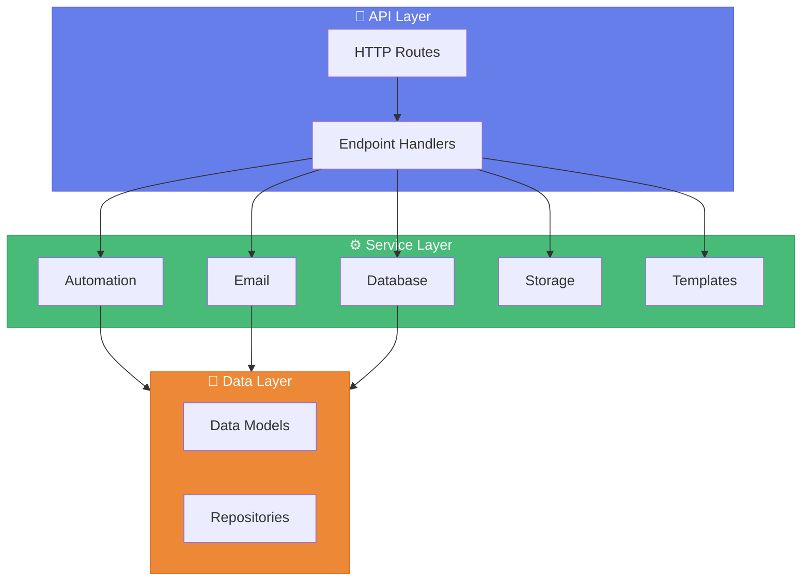

# ⚙️ EmailManagement Backend

> *FastAPI-powered REST API for email management and automation*

[](https://python.org)
[](https://fastapi.tiangolo.com)
[](https://www.microsoft.com/sql-server)

---

## 📋 Overview

The backend provides a comprehensive RESTful API that handles:

| Capability | Description |
|------------|-------------|
| 🗄️ **Database Management** | Connection testing and CRUD operations |
| 📧 **Email Operations** | Record retrieval, sending, and status tracking |
| 🤖 **Automation Engine** | Scheduling, processing, and retry mechanisms |
| ☁️ **Google Drive** | Large file uploads and shareable links |
| 📝 **Template Management** | Create, validate, and apply email templates |
| 📊 **Logging & Monitoring** | Activity logs and error handling |

---

## 🏗️ Architecture



---

## 📁 Project Structure

```
backend/
├── 📄 .env                          # Environment configuration
├── 📄 requirements.txt              # Python dependencies
├── 📄 run.py                        # Application entry point
│
├── 📂 database/                     # SQL Scripts
│   ├── email_tables.sql
│   ├── email_records_procedures.sql
│   └── setup_stored_procedures.sql
│
├── 📂 templates/                    # Email Templates
├── 📂 Email_Archive/                # Sent email archives
│
└── 📂 app/                          # Main Application
    ├── main.py                      # FastAPI app definition
    │
    ├── 📂 api/                      # API Endpoints
    │   ├── email_records_router.py
    │   └── endpoints/
    │       ├── automation.py
    │       ├── database.py
    │       ├── emails.py
    │       └── templates.py
    │
    ├── 📂 core/                     # Core Modules
    │   ├── config.py                # Configuration
    │   └── database.py              # DB connections
    │
    ├── 📂 models/                   # Data Models
    │   ├── email.py
    │   └── email_record.py
    │
    ├── 📂 services/                 # Business Logic
    │   ├── 📂 automation/           # Automation engine
    │   │   ├── core/                # Core automation
    │   │   ├── database/            # DB operations
    │   │   ├── processing/          # Email processing
    │   │   ├── scheduling/          # Schedule management
    │   │   ├── templates/           # Template handling
    │   │   └── validation/          # Input validation
    │   │
    │   ├── 📂 database/             # Database services
    │   │   ├── core/
    │   │   └── repositories/
    │   │
    │   ├── 📂 email/                # Email services
    │   │   ├── core/                # Email sending
    │   │   ├── gdrive/              # Drive integration
    │   │   └── status/              # Status management
    │   │
    │   ├── 📂 storage/              # Storage services
    │   │   └── gdrive/
    │   │
    │   └── 📂 templates/            # Template services
    │       ├── core/
    │       └── validation/
    │
    └── 📂 utils/                    # Utilities
        └── db_utils.py
```

---

## 🚀 Quick Start

### Option 1: Portable Environment ⭐ Recommended

```powershell
# From project root
.\start_backend.ps1
```

This automatically:
- ✅ Sets up portable Python environment
- ✅ Installs dependencies
- ✅ Starts FastAPI server

**Access:** http://localhost:8000

### Option 2: Manual Setup

<details>
<summary><b>📋 Click to expand</b></summary>

<br>

```powershell
# 1. Navigate to backend
cd backend

# 2. Create virtual environment
python -m venv venv
.\venv\Scripts\activate

# 3. Install dependencies
pip install -r requirements.txt

# 4. Create .env file (see Configuration section)

# 5. Run
python run.py
```

</details>

---

## ⚙️ Configuration

Create `.env` in the `backend/` directory:

```env
# 🗄️ Database
DB_SERVER=localhost\SQLEXPRESS
DB_NAME=EmailManagement
DB_USER=your_username
DB_PASSWORD=your_password
DB_DRIVER=ODBC Driver 17 for SQL Server

# 📧 Email
SMTP_SERVER=smtp.gmail.com
SMTP_PORT=587
SMTP_TLS=true
EMAIL_USERNAME=your.email@gmail.com
EMAIL_PASSWORD=your_app_password
SENDER_EMAIL=your.email@gmail.com
EMAIL_ARCHIVE_PATH=./Email_Archive

# ☁️ Google Drive (Optional)
GDRIVE_CREDENTIALS_PATH=../credentials/oauth_credentials.json
GDRIVE_FOLDER_ID=your_folder_id

# 🔌 API
API_PORT=8000
CORS_ORIGINS=["http://localhost:5173"]

# 📋 Logging
LOG_LEVEL=INFO
```

---

## 🔌 API Endpoints

### System

| Method | Endpoint | Description |
|--------|----------|-------------|
| `GET` | `/` | Verify API is running |
| `GET` | `/health` | Health check |
| `GET` | `/api/config` | Configuration (masked) |

### Database

| Method | Endpoint | Description |
|--------|----------|-------------|
| `POST` | `/api/database/test` | Test connection |

### Email Records

| Method | Endpoint | Description |
|--------|----------|-------------|
| `GET` | `/api/email-records/` | List records (paginated) |
| `GET` | `/api/email-records/{id}` | Get record |
| `PUT` | `/api/email-records/{id}` | Update record |
| `PUT` | `/api/email-records/{id}/status` | Update status |
| `DELETE` | `/api/email-records/{id}` | Delete record |

### Templates

| Method | Endpoint | Description |
|--------|----------|-------------|
| `GET` | `/api/templates` | List templates |
| `GET` | `/api/templates/{id}` | Get template |
| `POST` | `/api/templates` | Create template |
| `PUT` | `/api/templates/{id}` | Update template |
| `DELETE` | `/api/templates/{id}` | Delete template |

### Automation

| Method | Endpoint | Description |
|--------|----------|-------------|
| `GET` | `/api/automation/settings` | Get settings |
| `POST` | `/api/automation/settings` | Update settings |
| `GET` | `/api/automation/status` | Get status |
| `POST` | `/api/automation/start` | Start automation |
| `POST` | `/api/automation/stop` | Stop automation |
| `POST` | `/api/automation/restart-failed` | Retry failed |
| `GET` | `/api/automation/schedule` | Get schedule |
| `POST` | `/api/automation/schedule` | Update schedule |
| `POST` | `/api/automation/schedule/enable` | Enable schedule |
| `POST` | `/api/automation/schedule/disable` | Disable schedule |
| `GET` | `/api/automation/logs` | Get logs |
| `POST` | `/api/automation/test-mail` | Send test email |

### Google Drive

| Method | Endpoint | Description |
|--------|----------|-------------|
| `GET` | `/api/gdrive/status` | Integration status |
| `POST` | `/api/gdrive/upload` | Upload file |
| `GET` | `/api/gdrive/shared-link/{id}` | Get shareable link |
| `GET` | `/api/gdrive/space-usage` | Storage stats |

---

## 🧪 Testing

### PowerShell

```powershell
# Health check
Invoke-WebRequest -Uri http://localhost:8000/health | 
    Select-Object -ExpandProperty Content

# Test database
$body = '{"server":"localhost","database":"EmailManagement","username":"user","password":"pass"}'
Invoke-WebRequest -Method POST -Uri http://localhost:8000/api/database/test `
    -ContentType "application/json" -Body $body
```

### curl

```bash
# Health check
curl http://localhost:8000/health

# Configuration
curl http://localhost:8000/api/config
```

---

## 🗄️ Database Setup

Run SQL scripts in the `database/` directory:

| Script | Purpose |
|--------|---------|
| `email_tables.sql` | Create tables |
| `email_records_procedures.sql` | Stored procedures |
| `setup_stored_procedures.sql` | Master setup |

```powershell
sqlcmd -S localhost\SQLEXPRESS -d EmailManagement -i database\email_tables.sql
```

---

## 📚 Documentation

| Document | Description |
|----------|-------------|
| [Backend Setup](../docs/BACKEND_SETUP.md) | Detailed setup guide |
| [Google Drive Setup](../docs/GOOGLE_DRIVE_SETUP.md) | GDrive integration |
| [Google Auth Setup](../docs/GOOGLE_AUTH_SETUP.md) | Gmail authentication |

---

## 📄 License

MIT License
