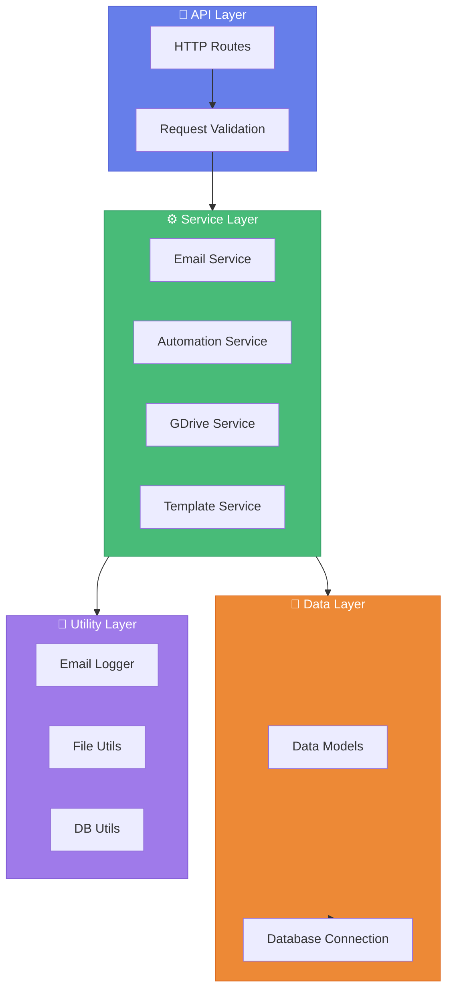

# ⚙️ Backend Setup Guide

> *Detailed instructions for setting up the EmailManagement FastAPI backend.*

---

## 📋 Overview

The EmailManagement backend is built with **FastAPI** and provides a comprehensive RESTful API that handles:

| Capability | Description |
|------------|-------------|
| 🗄️ Database Management | Connection testing and record operations |
| 📧 Email Operations | Record retrieval, template management |
| 🤖 Automation | Scheduling, retry mechanisms, process control |
| ☁️ Google Drive | Large file uploads and sharing |
| 📊 Logging | Comprehensive error handling and activity logs |

---

## ✅ Prerequisites

| Requirement | Details |
|-------------|---------|
| 💻 Windows | 10/11 for portable Python setup |
| 🗄️ SQL Server | 2016 or higher |
| 🌐 Internet | For downloading dependencies |

---

## 📁 Project Structure

```
backend/
├── 📄 .env                          # Environment configuration
├── 📄 requirements.txt              # Python dependencies
├── 📄 run.py                        # Application entry point
├── 📄 run_with_portable_env.ps1     # Portable Python runner
│
├── 📂 database/                     # SQL Scripts
│   ├── email_tables.sql             # Table definitions
│   ├── email_records_procedures.sql # Stored procedures
│   └── setup_stored_procedures.sql  # Procedure setup
│
├── 📂 templates/                    # Email Templates
│   ├── default_template.txt
│   └── custom_template.txt
│
├── 📂 Email_Archive/                # Sent email archives
├── 📂 portable_python/              # Portable Python runtime
├── 📂 portable_venv/                # Virtual environment
│
└── 📂 app/                          # Main Application
    ├── __init__.py
    ├── main.py                      # FastAPI app definition
    │
    ├── 📂 api/                      # API Endpoints
    │   ├── email_records_router.py
    │   └── endpoints/
    │       ├── automation.py
    │       ├── database.py
    │       ├── emails.py
    │       └── templates.py
    │
    ├── 📂 core/                     # Core Modules
    │   ├── config.py                # Configuration handling
    │   └── database.py              # DB connection handling
    │
    ├── 📂 models/                   # Data Models
    │   ├── email.py
    │   └── email_record.py
    │
    ├── 📂 services/                 # Business Logic
    │   ├── automation_service.py
    │   ├── email_record_service.py
    │   ├── email_sender.py
    │   ├── email_service.py
    │   ├── gdrive_service.py
    │   └── template_service.py
    │
    └── 📂 utils/                    # Utilities
        ├── db_utils.py
        ├── email_logger.py
        └── file_utils.py
```

---

## 🚀 Setup Methods

### Option 1: Portable Python Environment ⭐ Recommended

This method creates a self-contained, portable Python environment.

```powershell
# From project root directory
.\start_backend.ps1
```

This script automatically:
- ✅ Uses pre-packaged portable Python
- ✅ Activates the virtual environment
- ✅ Installs missing dependencies
- ✅ Starts the FastAPI server

**Verify Installation:**
```
http://localhost:8000/health
```

You should see: `{"status": "ok"}`

---

### Option 2: System Python

<details>
<summary><b>📋 Manual Setup Instructions</b></summary>

<br>

**1. Verify Python Version**
```powershell
python --version  # Should be 3.11+
```

**2. Create Virtual Environment**
```powershell
cd backend
python -m venv venv
.\venv\Scripts\activate
```

**3. Install Dependencies**
```powershell
pip install -r requirements.txt
```

**4. Create `.env` File**
```env
# Database settings
DB_SERVER=your_sql_server
DB_NAME=your_database
DB_USER=your_username
DB_PASSWORD=your_password

# Email settings
SMTP_SERVER=smtp.gmail.com
SMTP_PORT=587
SMTP_TLS=true
EMAIL_USERNAME=your_email@gmail.com
EMAIL_PASSWORD=your_app_password
SENDER_EMAIL=your_email@gmail.com
EMAIL_ARCHIVE_PATH=./Email_Archive

# Google Drive (optional)
GDRIVE_CREDENTIALS_PATH=../credentials/oauth_credentials.json
GDRIVE_FOLDER_ID=your_folder_id_here

# API settings
API_PORT=8000
CORS_ORIGINS=["http://localhost:5173", "http://127.0.0.1:5173"]

# Logging
LOG_LEVEL=INFO
LOG_FILE=./logs/email_app.log
```

**5. Run the Application**
```powershell
python run.py
```

</details>

---

## 🗄️ Database Setup

1. Run the SQL scripts in the `database/` directory:

| Script | Purpose |
|--------|---------|
| `email_tables.sql` | Creates EmailRecords table |
| `email_records_procedures.sql` | Record stored procedures |
| `setup_stored_procedures.sql` | Master setup script |

2. Execute via SSMS or command line:
```powershell
sqlcmd -S localhost\SQLEXPRESS -d EmailManagement -i database\email_tables.sql
```

---

## 🔌 API Endpoints

### System Endpoints

| Method | Endpoint | Description |
|--------|----------|-------------|
| `GET` | `/` | Root - Verify API is running |
| `GET` | `/health` | Health check |
| `GET` | `/api/config` | Show configuration (masked) |

### Database Endpoints

| Method | Endpoint | Description |
|--------|----------|-------------|
| `POST` | `/api/database/test` | Test database connection |

### Email Records Endpoints

| Method | Endpoint | Description |
|--------|----------|-------------|
| `GET` | `/api/email-records/` | Get paginated records |
| `GET` | `/api/email-records/{id}` | Get specific record |
| `PUT` | `/api/email-records/{id}` | Update record |
| `PUT` | `/api/email-records/{id}/status` | Update status |
| `DELETE` | `/api/email-records/{id}` | Delete record |

### Template Endpoints

| Method | Endpoint | Description |
|--------|----------|-------------|
| `GET` | `/api/templates` | List all templates |
| `GET` | `/api/templates/{id}` | Get specific template |
| `POST` | `/api/templates` | Create template |
| `PUT` | `/api/templates/{id}` | Update template |
| `DELETE` | `/api/templates/{id}` | Delete template |

### Automation Endpoints

| Method | Endpoint | Description |
|--------|----------|-------------|
| `GET` | `/api/automation/settings` | Get settings |
| `POST` | `/api/automation/settings` | Update settings |
| `GET` | `/api/automation/status` | Get status |
| `POST` | `/api/automation/start` | Start automation |
| `POST` | `/api/automation/stop` | Stop automation |
| `POST` | `/api/automation/restart-failed` | Retry failed emails |
| `GET` | `/api/automation/schedule` | Get schedule |
| `POST` | `/api/automation/schedule` | Update schedule |
| `POST` | `/api/automation/schedule/enable` | Enable scheduling |
| `POST` | `/api/automation/schedule/disable` | Disable scheduling |
| `GET` | `/api/automation/logs` | Get process logs |

### Google Drive Endpoints

| Method | Endpoint | Description |
|--------|----------|-------------|
| `GET` | `/api/gdrive/status` | Integration status |
| `POST` | `/api/gdrive/upload` | Upload file |
| `GET` | `/api/gdrive/shared-link/{id}` | Get shareable link |
| `GET` | `/api/gdrive/space-usage` | Storage statistics |

---

## 🧪 Testing the API

### Using PowerShell

```powershell
# Health check
Invoke-WebRequest -Method GET -Uri http://localhost:8000/health | 
    Select-Object -ExpandProperty Content

# Get configuration
Invoke-WebRequest -Method GET -Uri http://localhost:8000/api/config | 
    Select-Object -ExpandProperty Content

# Test database connection
$body = @{
    server = "your_server"
    database = "your_database"
    username = "your_username"
    password = "your_password"
} | ConvertTo-Json

Invoke-WebRequest -Method POST -Uri http://localhost:8000/api/database/test `
    -ContentType "application/json" -Body $body
```

### Using curl

```bash
# Health check
curl -X GET http://localhost:8000/health

# Get configuration
curl -X GET http://localhost:8000/api/config

# Test database connection
curl -X POST http://localhost:8000/api/database/test \
    -H "Content-Type: application/json" \
    -d '{"server":"your_server","database":"your_db","username":"user","password":"pass"}'
```

---

## 🏛️ Architecture



---

## 🔧 Troubleshooting

<details>
<summary><b>🔴 Port 8000 Already in Use</b></summary>

<br>

1. Change `API_PORT` in `.env` file
2. Update frontend `API_BASE_URL` to match

</details>

<details>
<summary><b>🔴 Database Connection Failed</b></summary>

<br>

- ✅ Verify SQL Server is running
- ✅ Check connection credentials
- ✅ Ensure user has database permissions
- ✅ Verify SQL Server authentication is enabled

</details>

<details>
<summary><b>🔴 Missing Dependencies</b></summary>

<br>

```powershell
# Standard environment
pip install -r requirements.txt

# Portable environment
.\scripts\portable_env\setup.ps1
```

</details>

<details>
<summary><b>🔴 File Permission Errors</b></summary>

<br>

- Ensure write access to `Email_Archive/` directory
- Check template file permissions

</details>

---

## 📚 Related Documentation

- [Setup Guide](SETUP_GUIDE.md) - Complete installation walkthrough
- [Frontend Setup](FRONTEND_SETUP.md) - React app configuration
- [Google Drive Setup](GOOGLE_DRIVE_SETUP.md) - Large file integration
