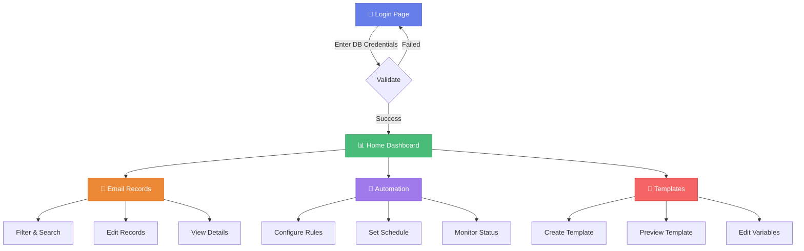
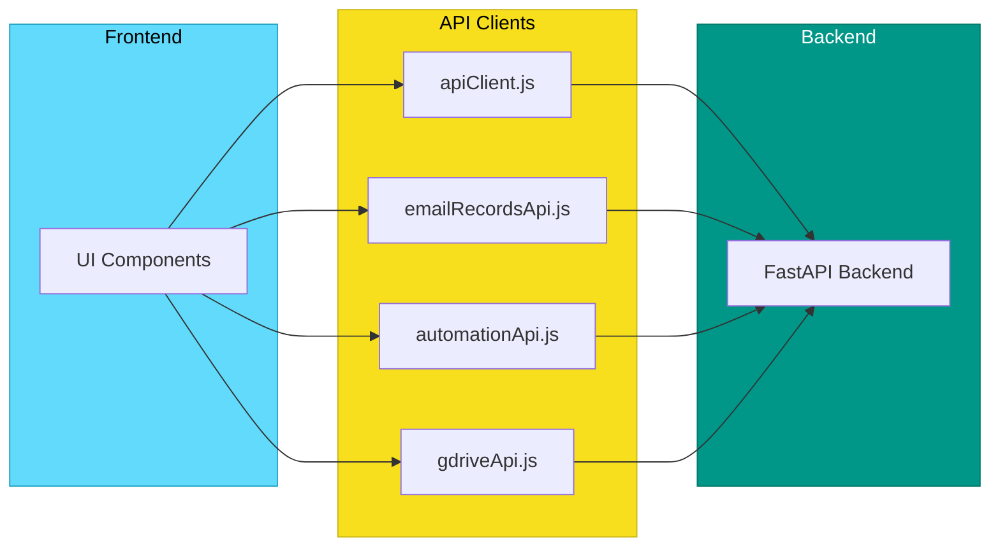

# 🎨 Frontend Setup Guide

> *Detailed instructions for setting up the EmailManagement React frontend.*

---

## 📋 Overview

The EmailManagement frontend provides a modern, responsive user interface for:

| Feature | Description |
|---------|-------------|
| 🔐 Database Connection | Secure credential input interface |
| 📊 Analytics Dashboard | Interactive charts and metrics |
| 📧 Email Records | Filtering, sorting, and management |
| 🤖 Automation Config | Scheduling and rule configuration |
| 📝 Template Management | Create and preview email templates |
| ☁️ Google Drive | Large attachment handling |

---

## ✅ Prerequisites

| Requirement | Version |
|-------------|---------|
| Node.js | 14.x or higher |
| npm | 6.x or higher |

---

## 📁 Project Structure

```
frontend/
├── 📂 public/                       # Static Assets
│   ├── favicon.ico
│   ├── index.html
│   └── manifest.json
│
├── 📂 src/                          # Source Code
│   │
│   ├── 📂 components/               # Reusable UI Components
│   │   ├── Alert.jsx                # Alert messages
│   │   ├── BrandingHeader.jsx       # Login page header
│   │   ├── Breadcrumb.jsx           # Navigation breadcrumb
│   │   ├── DatabaseConnector.jsx    # DB connection form
│   │   ├── EmailChart.jsx           # Analytics charts
│   │   ├── EmailStatusCard.jsx      # Status display cards
│   │   ├── Footer.jsx               # Application footer
│   │   ├── Header.jsx               # Main header
│   │   ├── MetricsPanel.jsx         # Dashboard metrics
│   │   ├── ProtectedRoute.jsx       # Route protection
│   │   ├── Sidebar.jsx              # Navigation sidebar
│   │   ├── StatusBadge.jsx          # Status indicators
│   │   ├── TemplateEditor.jsx       # Template editing
│   │   └── TemplatePreview.jsx      # Template preview
│   │
│   ├── 📂 features/                 # Feature Modules
│   │   └── email-records/
│   │       ├── EmailRecordEditModal.jsx
│   │       ├── emailRecordsApi.js
│   │       ├── EmailRecordsView.jsx
│   │       └── index.js
│   │
│   ├── 📂 pages/                    # Page Components
│   │   ├── AutomateEmail/           # Automation module
│   │   │   ├── AutomationDashboard.jsx
│   │   │   ├── AutomationSchedule.jsx
│   │   │   └── AutomationSettings.jsx
│   │   ├── EmailRecords/            # Records module
│   │   │   ├── EmailDetails.jsx
│   │   │   └── EmailList.jsx
│   │   ├── HomePage.jsx             # Main dashboard
│   │   └── LoginPage.jsx            # Login/connection
│   │
│   ├── 📂 utils/                    # Utility Functions
│   │   ├── apiClient.js             # API communication
│   │   ├── automationApi.js         # Automation API
│   │   ├── chartUtils.js            # Chart formatting
│   │   ├── constants.js             # App constants
│   │   ├── dateUtils.js             # Date utilities
│   │   ├── fileUtils.js             # File handling
│   │   ├── gdriveApi.js             # Google Drive API
│   │   └── sessionUtils.js          # Session management
│   │
│   ├── App.js                       # Main app component
│   ├── index.css                    # Global styles
│   └── index.jsx                    # Entry point
│
├── 📄 package.json                  # Dependencies
├── 📄 postcss.config.js             # PostCSS config
├── 📄 tailwind.config.js            # Tailwind config
└── 📄 vite.config.js                # Vite config
```

---

## 🚀 Setup Methods

### Option 1: Using Scripts ⭐ Recommended

```powershell
# From project root directory
.\start_frontend.ps1
```

This script automatically:
- ✅ Checks Node.js installation
- ✅ Installs dependencies if needed
- ✅ Starts the development server

**Access at:** http://localhost:5173

---

### Option 2: Manual Setup

```powershell
# Navigate to frontend
cd frontend

# Install dependencies
npm install

# Start development server
npm run dev
```

---

## 🏗️ Building for Production

```powershell
# Using script (from project root)
.\build_frontend.ps1

# Or manually
cd frontend
npm run build
```

Output is generated in `frontend/dist/` directory.

---

## 🔄 Application Workflow



---

## 🧩 Key Components

### Pages

| Component | Purpose |
|-----------|---------|
| `LoginPage` | Database connection entry point |
| `HomePage` | Main dashboard with status & quick actions |
| `AutomatePage` | Email automation configuration |
| `EmailRecordsPage` | Email record management |

### Core Components

| Component | Purpose |
|-----------|---------|
| `Header` / `BrandingHeader` | Navigation and branding |
| `Sidebar` | Collapsible navigation menu |
| `DatabaseConnector` | Credential input form |
| `StatusSummary` | Dashboard status statistics |
| `ProtectedRoute` | Route access control |
| `MetricsPanel` | Performance metrics display |

### Utility Modules

| Module | Purpose |
|--------|---------|
| `apiClient.js` | Centralized backend communication |
| `sessionUtils.js` | Session storage management |
| `dateUtils.js` | Date formatting functions |
| `chartUtils.js` | Chart data preparation |

---

## 🔌 API Integration

The frontend communicates through several API clients:



| Client | Purpose |
|--------|---------|
| `apiClient.js` | General API functions |
| `emailRecordsApi.js` | Email records CRUD |
| `automationApi.js` | Automation configuration |
| `gdriveApi.js` | Google Drive operations |

---

## 🎨 Customization

### Styling

The application uses **Tailwind CSS** for styling.

**Modify Design Tokens:**
```javascript
// tailwind.config.js
module.exports = {
  theme: {
    extend: {
      colors: {
        primary: '#your-color',
      },
    },
  },
}
```

**Add Custom Styles:**
```css
/* src/index.css */
.custom-class {
  /* your styles */
}
```

### API Endpoint Configuration

```javascript
// src/utils/apiClient.js
const API_BASE_URL = 'http://localhost:8000';  // Change if needed
```

> [!IMPORTANT]
> Update this URL if your backend runs on a different port.

---

## 🌐 Browser Compatibility

| Browser | Versions |
|---------|----------|
| Chrome | Latest 2 |
| Firefox | Latest 2 |
| Edge | Latest 2 |
| Safari | Latest 2 |

---

## 🔧 Troubleshooting

<details>
<summary><b>🔴 Node.js Version Error</b></summary>

<br>

```powershell
node --version  # Ensure 14.x or higher
```

Download latest from [nodejs.org](https://nodejs.org/)

</details>

<details>
<summary><b>🔴 Port 5173 Already in Use</b></summary>

<br>

Vite automatically selects the next available port. Check terminal output for the actual URL.

</details>

<details>
<summary><b>🔴 Backend Connection Failed</b></summary>

<br>

1. ✅ Verify backend server is running
2. ✅ Check `API_BASE_URL` in `apiClient.js`
3. ✅ Check browser console for CORS errors
4. ✅ Verify backend CORS settings include frontend URL

</details>

<details>
<summary><b>🔴 Build Errors</b></summary>

<br>

```powershell
# See detailed errors
npm run build

# Update dependencies
npm update

# Clear cache and reinstall
rm -rf node_modules
npm install
```

</details>

<details>
<summary><b>🔴 White Screen / Blank Page</b></summary>

<br>

1. Check browser console for JavaScript errors
2. Verify all dependencies are installed
3. Clear browser cache
4. Try incognito/private window

</details>

---

## 📚 Related Documentation

- [Setup Guide](SETUP_GUIDE.md) - Complete installation walkthrough
- [Backend Setup](BACKEND_SETUP.md) - API server configuration
- [Google Drive Setup](GOOGLE_DRIVE_SETUP.md) - Large file integration
