# 🔐 Google Authentication Setup

> *Configure Gmail SMTP authentication for sending emails through the EmailManagement application.*

---

## 📋 Overview

EmailManagement can send emails through Gmail's SMTP server using two authentication methods:

```mermaid
flowchart TD
    A[Choose Authentication Method] --> B{Use Case?}
    B -->|Personal/Simple| C[🔑 App Password]
    B -->|Multi-User/Production| D[🔒 OAuth 2.0]
    
    C --> C1[Enable 2FA]
    C1 --> C2[Generate App Password]
    C2 --> C3[Configure .env]
    
    D --> D1[Create GCP Project]
    D1 --> D2[Enable Gmail API]
    D2 --> D3[Configure OAuth]
    D3 --> D4[Run Setup Script]
    
    style C fill:#48bb78,stroke:#38a169,color:#fff
    style D fill:#667eea,stroke:#5a67d8,color:#fff
```



| Method | Best For | Complexity |
|--------|----------|------------|
| 🔑 **App Password** | Personal use, single user | ⭐ Simple |
| 🔒 **OAuth 2.0** | Multi-user, production | ⭐⭐⭐ Advanced |

---

## 🔑 Method 1: App Password Authentication

> ⭐ **Recommended for personal use**

### Prerequisites

- ✅ Google Account
- ✅ Two-Factor Authentication (2FA) enabled

### Step-by-Step Setup

#### Step 1: Enable 2-Step Verification

1. Go to [Google Account Security](https://myaccount.google.com/security)
2. Click on **"2-Step Verification"**
3. Follow the prompts to enable it

#### Step 2: Generate App Password

1. Go to [Google Account Security](https://myaccount.google.com/security)
2. Click on **"App passwords"** (you may need to re-enter your password)
3. Select:
   - **App**: Mail
   - **Device**: Windows Computer
4. Click **"Generate"**
5. **Copy the 16-character password** and keep it secure

> [!IMPORTANT]
> This password is shown only once. Store it securely!

#### Step 3: Configure EmailManagement

Update your `.env` file in the `backend/` directory:

```env
# 📧 Email sending configuration
EMAIL_SENDER=your.email@gmail.com
EMAIL_PASSWORD=your-16-character-app-password
EMAIL_SMTP_SERVER=smtp.gmail.com
EMAIL_SMTP_PORT=587
```

#### Step 4: Restart Backend

```powershell
.\start_backend.ps1
```

### ✅ Testing

1. Send a test email through the application
2. Check for successful delivery
3. Review application logs for any SMTP errors

---

## 🔒 Method 2: OAuth 2.0 Authentication

> **Recommended for multi-user or production environments**

### Prerequisites

- ✅ Google Account
- ✅ Google Cloud Platform account (free tier sufficient)

### Step-by-Step Setup

#### Step 1: Create Google Cloud Project

1. Go to [Google Cloud Console](https://console.cloud.google.com/)
2. Create a new project or select existing
3. Note your **Project ID**

#### Step 2: Enable Gmail API

1. Navigate to **APIs & Services** → **Library**
2. Search for **"Gmail API"**
3. Click **Enable**

#### Step 3: Configure OAuth Consent Screen

1. Go to **APIs & Services** → **OAuth consent screen**
2. Select **External** user type
3. Fill required fields:

| Field | Value |
|-------|-------|
| App name | EmailManagement |
| User support email | Your email |
| Developer contact | Your email |

4. Add scope: `https://www.googleapis.com/auth/gmail.send`
5. Add your email as a **test user**

#### Step 4: Create OAuth Client ID

1. Go to **APIs & Services** → **Credentials**
2. Click **Create Credentials** → **OAuth client ID**
3. Select **Desktop application**
4. Name: `EmailManagement Desktop Client`
5. Click **Create**
6. **Download JSON** file
7. Save as `gmail_oauth_credentials.json` in `credentials/` folder

#### Step 5: Configure Environment

```env
# 📧 Email sending configuration (OAuth)
EMAIL_SENDER=your.email@gmail.com
EMAIL_USE_OAUTH=true
EMAIL_OAUTH_CREDENTIALS_PATH=../credentials/gmail_oauth_credentials.json
EMAIL_SMTP_SERVER=smtp.gmail.com
EMAIL_SMTP_PORT=587
```

#### Step 6: Run OAuth Setup

On first run, the application will:
1. 🌐 Open a browser for sign-in
2. 🔐 Request permission to send emails
3. 💾 Save authentication token

---

## 🔧 Troubleshooting

### App Password Issues

<details>
<summary><b>🔴 Authentication Failed</b></summary>

<br>

| Check | Solution |
|-------|----------|
| Password format | Remove any spaces |
| Email address | Use correct Gmail address |
| 2FA status | Ensure 2FA is enabled |

</details>

<details>
<summary><b>🔴 Connection Timeout</b></summary>

<br>

- Check firewall/antivirus settings
- Ensure port 587 is open for outgoing connections
- Try port 465 with SSL instead

</details>

### OAuth Issues

<details>
<summary><b>🔴 Redirect URI Mismatch</b></summary>

<br>

Ensure OAuth client is configured as **Desktop application**.

</details>

<details>
<summary><b>🔴 Token Refresh Failed</b></summary>

<br>

Delete token file and re-authenticate:
```powershell
del credentials\gmail_token.pickle
python run.py  # Re-authenticate
```

</details>

<details>
<summary><b>🔴 Scope Issues</b></summary>

<br>

1. Verify Gmail API is enabled
2. Check OAuth consent screen scopes
3. Re-run setup if scopes changed

</details>

---

## 🛡️ Security Best Practices

> [!CAUTION]
> Never commit credentials to version control!

| Practice | Details |
|----------|---------|
| 🔒 Gitignore credentials | Add `gmail_oauth_credentials.json` and token files |
| 🔐 Use environment variables | Prefer env vars in production over `.env` files |
| 🔄 Rotate credentials | Generate new passwords/secrets periodically |
| 📋 Audit access | Review authorized apps in Google Account |

---

## 📚 Additional Resources

| Resource | Link |
|----------|------|
| Google App Passwords | [Documentation](https://support.google.com/accounts/answer/185833) |
| Gmail API Guide | [Documentation](https://developers.google.com/gmail/api/guides) |
| OAuth 2.0 for Desktop | [Documentation](https://developers.google.com/identity/protocols/oauth2/native-app) |

---

## 📚 Related Documentation

- [Setup Guide](SETUP_GUIDE.md) - Complete installation walkthrough
- [Backend Setup](BACKEND_SETUP.md) - API server configuration
- [Google Drive Setup](GOOGLE_DRIVE_SETUP.md) - Large file integration
