# ☁️ Google Drive Integration Setup

> *Configure Google Drive for handling large email attachments (> 20MB) in EmailManagement.*

---

## 📋 Overview

When an email attachment exceeds Gmail's 20MB limit, EmailManagement can:

```mermaid
flowchart LR
    A[📎 Large Attachment] --> B{Size > 20MB?}
    B -->|Yes| C[☁️ Upload to GDrive]
    B -->|No| D[📧 Direct Attach]
    C --> E[🔗 Generate Link]
    E --> F[📧 Send with Link]
    D --> G[✅ Email Sent]
    F --> G
    
    style A fill:#667eea,stroke:#5a67d8,color:#fff
    style C fill:#4285f4,stroke:#3367d6,color:#fff
    style G fill:#48bb78,stroke:#38a169,color:#fff
```



| Feature | Description |
|---------|-------------|
| ☁️ Auto-upload | Files > 20MB uploaded automatically |
| 🔗 Shareable links | Customizable permission levels |
| ⏰ Expiring access | Time-limited link validity |
| 🔐 Access control | Per-recipient permissions |
| 📁 Organization | Date-based folder structure |

---

## ✅ Prerequisites

| Requirement | Details |
|-------------|---------|
| 📧 Google Account | Personal or Workspace |
| ☁️ Google Cloud Platform | Free tier sufficient |
| 💿 EmailManagement | Installed and configured |

---

## 🔀 Setup Methods Comparison

| Feature | Personal (OAuth) | Service Account |
|---------|-----------------|-----------------|
| **Best for** | Personal use | Server/automated |
| **File visibility** | Your Drive | Shared folder |
| **User interaction** | Browser auth required | No interaction |
| **Complexity** | ⭐⭐ Moderate | ⭐⭐⭐ Advanced |

---

## 👤 Method 1: Personal Google Account (OAuth)

> ⭐ **Recommended for most users**

### Step 1: Create Google Cloud Project

1. Go to [Google Cloud Console](https://console.cloud.google.com/)
2. Click project dropdown → **New Project**
3. Enter name: `EmailManagement`
4. Click **Create**
5. Select the new project

### Step 2: Enable Google Drive API

1. Navigate to **APIs & Services** → **Library**
2. Search for **"Google Drive API"**
3. Click **Enable**

### Step 3: Configure OAuth Consent Screen

1. Go to **APIs & Services** → **OAuth consent screen**
2. Select **External** user type → **Create**
3. Fill in required fields:

| Field | Value |
|-------|-------|
| App name | EmailManagement App |
| User support email | Your email |
| Developer contact | Your email |

4. Click **Save and Continue**
5. On Scopes page, click **Add or Remove Scopes**
6. Select: `https://www.googleapis.com/auth/drive`
7. Click **Update** → **Save and Continue**
8. Add your email as a **Test User**
9. Click **Save and Continue** → **Back to Dashboard**

### Step 4: Create OAuth Credentials

1. Go to **APIs & Services** → **Credentials**
2. Click **+ Create Credentials** → **OAuth client ID**
3. Application type: **Desktop application**
   
   > [!TIP]
   > If "Desktop application" isn't available, try "Other" or "Web application"

4. Name: `EmailManagement Desktop App`
5. Click **Create**
6. Click **Download JSON**
7. Save as `oauth_credentials.json` in `credentials/` folder

### Step 5: Run Setup Script

```powershell
# Ensure credentials file is in place
# EmailManagement/credentials/oauth_credentials.json

# Install dependencies
pip install google-api-python-client google-auth-httplib2 google-auth-oauthlib

# Run setup
cd credentials
python setup_gdrive_oauth.py
```

**During setup:**
1. 🌐 Browser opens automatically
2. 🔐 Sign in to your Google account
3. ⚠️ Click **Advanced** → **Go to [App Name] (unsafe)** on warning
4. ✅ Grant Drive access permission
5. 📁 Script displays available folders

### Step 6: Configure Environment

Update `backend/.env`:

```env
# ☁️ Google Drive Configuration
GDRIVE_CREDENTIALS_PATH=../credentials/oauth_credentials.json
GDRIVE_TOKEN_PATH=../credentials/token.pickle
GDRIVE_FOLDER_ID=your_folder_id_here
GDRIVE_SHARING_OPTION=anyone
GDRIVE_FILE_EXPIRY_DAYS=30
```

---

## 🤖 Method 2: Service Account

> **For server environments without user interaction**

<details>
<summary><b>📋 Click to expand Service Account setup</b></summary>

<br>

### Step 1: Create Google Cloud Project

Same as Method 1, Steps 1-2.

### Step 2: Create Service Account

1. Go to **IAM & Admin** → **Service Accounts**
2. Click **Create Service Account**
3. Enter name and description
4. Click **Create and Continue**
5. Grant **Editor** role
6. Click **Continue** → **Done**

### Step 3: Create Key

1. Click on your service account email
2. Go to **Keys** tab
3. Click **Add Key** → **Create new key**
4. Select **JSON**
5. Click **Create**
6. Save as `gdrive_credentials.json` in `credentials/`

### Step 4: Configure Drive Access

1. Create a shared folder in Google Drive
2. Share folder with service account email (from JSON file)
3. Copy folder ID from Drive URL

### Step 5: Configure Environment

```env
# ☁️ Google Drive Configuration (Service Account)
GDRIVE_CREDENTIALS_PATH=../credentials/gdrive_credentials.json
GDRIVE_USE_SERVICE_ACCOUNT=true
GDRIVE_FOLDER_ID=your_folder_id_here
GDRIVE_SHARING_OPTION=anyone
GDRIVE_FILE_EXPIRY_DAYS=30
GDRIVE_NOTIFICATION_EMAIL=false
```

</details>

---

## ✅ Testing the Integration

1. **Restart backend server**
2. **Send email with large attachment** (> 20MB)
3. **Verify:**
   - ✅ File appears in Google Drive folder
   - ✅ Email contains download link
   - ✅ Link works when clicked

---

## ⚙️ Configuration Options

### Sharing Permissions

| Option | Description |
|--------|-------------|
| `anyone` | Anyone with link can access (most permissive) |
| `domain` | Only organization users can access |
| `private` | Only specific email addresses |

### Expiring Links

| Setting | Effect |
|---------|--------|
| `30` | Links expire after 30 days |
| `7` | Links expire after 7 days |
| `0` | Links never expire |

### File Organization

Files are automatically organized:

```
📁 GDRIVE_FOLDER_ID/
├── 📁 2026-01-11/
│   ├── EMAIL_001_attachment.pdf
│   └── EMAIL_002_report.xlsx
├── 📁 2026-01-12/
│   └── EMAIL_003_document.docx
```

---

## 🔧 Troubleshooting

### OAuth Setup Issues

<details>
<summary><b>🔴 "Desktop application" not available</b></summary>

<br>

1. Complete OAuth consent screen setup first
2. Try "Other" or "Web application" type
3. For Web app, add `http://localhost` to redirect URIs

</details>

<details>
<summary><b>🔴 "This app isn't verified" warning</b></summary>

<br>

This is normal for personal projects:
1. Click **Advanced** or **Continue**
2. Click **Go to [App Name] (unsafe)**

</details>

<details>
<summary><b>🔴 Access denied errors</b></summary>

<br>

1. Verify you're added as a test user
2. Check correct Drive scope is selected
3. Delete `token.pickle` and re-run setup

</details>

### Upload Issues

<details>
<summary><b>🔴 Files not appearing in Drive</b></summary>

<br>

| Check | Solution |
|-------|----------|
| Folder ID | Verify in `.env` matches actual folder |
| Token | Re-run setup script to refresh |
| Quota | Check Drive storage isn't full |
| Logs | Review application logs for API errors |

</details>

<details>
<summary><b>🔴 Token/pickle errors</b></summary>

<br>

```powershell
# Delete old token and re-authenticate
del credentials\token.pickle
python credentials\setup_gdrive_oauth.py
```

</details>

---

## 🛡️ Security Best Practices

> [!CAUTION]
> Keep credentials secure!

| Practice | Details |
|----------|---------|
| 🔒 Gitignore | Add `token.pickle` and `oauth_credentials.json` to `.gitignore` |
| 🔐 Compromised tokens | Revoke in Google Account → Security → Third-party apps |
| 🔄 Token refresh | Re-run setup if experiencing auth issues |
| 📋 Regular testing | Periodically verify large file uploads work |

---

## 📊 Advanced Features

### API Usage Monitoring

```
GET /api/gdrive/usage
```

Returns current quota usage and limits.

### Access Control by Email

When using `private` sharing:
1. System extracts recipient emails
2. Grants Drive access only to those addresses
3. Tracks permissions in database

---

## 📚 Related Documentation

- [Setup Guide](SETUP_GUIDE.md) - Complete installation walkthrough
- [Backend Setup](BACKEND_SETUP.md) - API server configuration
- [Google Auth Setup](GOOGLE_AUTH_SETUP.md) - Gmail SMTP authentication
