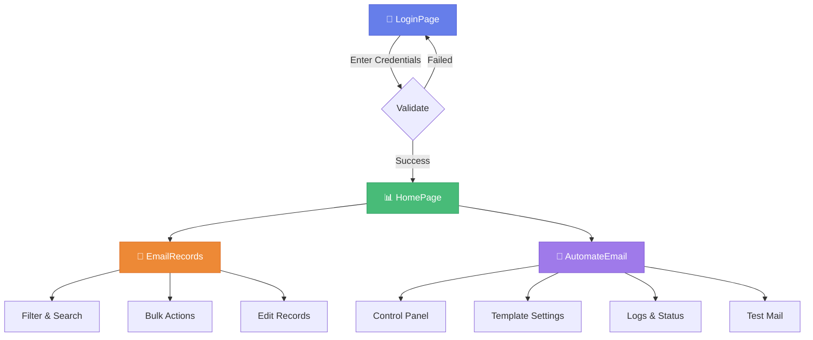
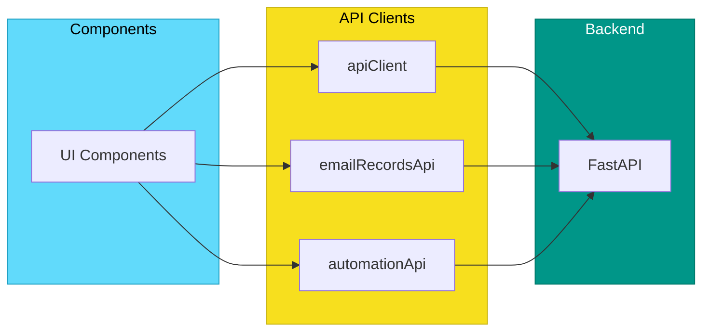

# 🎨 EmailManagement Frontend

> *Modern React-based UI for email management and automation*

[](https://reactjs.org)
[](https://vitejs.dev)
[](https://tailwindcss.com)

---

## 📋 Overview

The frontend provides a modern, responsive user interface featuring:

| Feature | Description |
|---------|-------------|
| 🔐 **Database Connection** | Secure credential management |
| 📊 **Analytics Dashboard** | Interactive charts & metrics |
| 📧 **Email Records** | Advanced filtering & management |
| 🤖 **Automation Control** | Scheduling & monitoring |
| 📝 **Template Editor** | Rich text editing & preview |
| ⭐ **Modern UI/UX** | Animations, dark theme, glassmorphism |

---

## ✨ Key Features

- **Starry Background Animations** - Twinkling stars and shooting stars
- **Glassmorphism Design** - Modern frosted glass effects
- **Responsive Layout** - Desktop, tablet, and mobile support
- **Protected Routes** - Secure access control
- **Real-time Status** - Live automation monitoring
- **Bulk Operations** - Efficient record management

---

## 🛠️ Tech Stack

| Category | Technology |
|----------|------------|
| Framework | React 18 |
| Build Tool | Vite |
| Styling | Tailwind CSS |
| Routing | React Router v6 |
| Notifications | React Toastify |
| Icons | Heroicons |
| Rich Text | React Quill |

---

## 📁 Project Structure

```
frontend/
├── 📂 public/                       # Static Assets
│   ├── favicon.ico
│   └── index.html
│
├── 📂 src/                          # Source Code
│   │
│   ├── 📄 App.js                    # Main app component
│   ├── 📄 routes.jsx                # Route definitions
│   ├── 📄 index.jsx                 # Entry point
│   ├── 📄 index.css                 # Global styles
│   │
│   ├── 📂 components/               # Reusable Components
│   │   ├── 📂 Table/                # Data table components
│   │   ├── 📂 auth/                 # Authentication
│   │   ├── 📂 charts/               # Chart components
│   │   ├── 📂 database/             # DB connection UI
│   │   ├── 📂 dragdrop/             # Drag & drop
│   │   ├── 📂 email/                # Email components
│   │   ├── 📂 file/                 # File handling
│   │   ├── 📂 gdrive/               # Google Drive UI
│   │   ├── 📂 layout/               # Layout components
│   │   │   ├── Header.jsx
│   │   │   ├── Sidebar.jsx
│   │   │   └── Footer.jsx
│   │   ├── 📂 scheduler/            # Scheduling UI
│   │   └── 📂 ui/                   # Core UI components
│   │       ├── Alert.jsx
│   │       ├── Badge/
│   │       ├── BrandingHeader.jsx
│   │       ├── StarryBackground.jsx # Animated background
│   │       ├── Toast.jsx
│   │       └── Welcome.jsx
│   │
│   ├── 📂 pages/                    # Page Components
│   │   ├── 📄 LoginPage.jsx         # Login/connection
│   │   ├── 📄 HomePage.jsx          # Dashboard
│   │   │
│   │   ├── 📂 AutomateEmail/        # Automation Module
│   │   │   ├── index.jsx            # Main component
│   │   │   ├── 📂 components/       # UI components
│   │   │   │   ├── AutomationControlPanel.jsx
│   │   │   │   ├── StatusSection.jsx
│   │   │   │   ├── TemplateSettings.jsx
│   │   │   │   ├── ArchiveManagement.jsx
│   │   │   │   ├── EmailLogs.jsx
│   │   │   │   └── TestMailModal.jsx
│   │   │   └── 📂 hooks/            # State management
│   │   │       ├── useAutomationStatus.js
│   │   │       └── useAutomationActions.js
│   │   │
│   │   └── 📂 EmailRecords/         # Records Module
│   │       ├── EmailRecordsPage.jsx # Main component
│   │       ├── 📂 components/       # UI components
│   │       │   ├── EmailRecordsTable.jsx
│   │       │   ├── FilterBar.jsx
│   │       │   ├── BulkActions.jsx
│   │       │   ├── Pagination.jsx
│   │       │   └── StatusBadge.jsx
│   │       └── 📂 hooks/            # State management
│   │           ├── useEmailRecords.js
│   │           └── useEmailRecordFilters.js
│   │
│   ├── 📂 hooks/                    # Global Hooks
│   │
│   ├── 📂 styles/                   # Additional Styles
│   │
│   └── 📂 utils/                    # Utilities
│       ├── apiClient.js             # Backend API
│       ├── automationApi.js         # Automation API
│       ├── emailRecordsApi.js       # Records API
│       ├── sessionUtils.js          # Session management
│       ├── dateUtils.js             # Date formatting
│       ├── formatUtils.js           # Data formatting
│       └── constants.js             # App constants
│
├── 📄 package.json                  # Dependencies
├── 📄 vite.config.js                # Vite config
├── 📄 tailwind.config.js            # Tailwind config
└── 📄 postcss.config.js             # PostCSS config
```

---

## 🔄 Application Flow



---

## 🚀 Quick Start

### Option 1: Using Scripts ⭐ Recommended

```powershell
# From project root
.\start_frontend.ps1
```

This automatically:
- ✅ Checks Node.js installation
- ✅ Installs dependencies
- ✅ Starts development server

**Access:** http://localhost:5173

### Option 2: Manual Setup

```bash
# Navigate to frontend
cd frontend

# Install dependencies
npm install

# Start dev server
npm run dev
```

---

## 🏗️ Building for Production

```bash
# Build
npm run build

# Preview production build
npm run preview
```

Output: `frontend/dist/`

---

## 🧩 Key Components

### Pages

| Component | Purpose |
|-----------|---------|
| `LoginPage` | Database connection entry |
| `HomePage` | Dashboard with metrics & charts |
| `AutomateEmail` | Automation control center |
| `EmailRecords` | Record management interface |

### UI Components

| Component | Purpose |
|-----------|---------|
| `Header` | Navigation & branding |
| `Sidebar` | Collapsible navigation |
| `StarryBackground` | Animated particle background |
| `Alert` | Notification messages |
| `Badge` | Status indicators |
| `BrandingHeader` | Login page header |

### Automation Components

| Component | Purpose |
|-----------|---------|
| `AutomationControlPanel` | Start/stop controls |
| `StatusSection` | Real-time status display |
| `TemplateSettings` | Template configuration |
| `ArchiveManagement` | Archive controls |
| `EmailLogs` | Activity log viewer |
| `TestMailModal` | Test email sender |

### Email Records Components

| Component | Purpose |
|-----------|---------|
| `EmailRecordsTable` | Data grid display |
| `FilterBar` | Search & filter controls |
| `BulkActions` | Multi-select operations |
| `Pagination` | Page navigation |
| `StatusBadge` | Status indicator |

---

## 🔌 API Integration



| Client | Purpose |
|--------|---------|
| `apiClient.js` | General API (database, config) |
| `emailRecordsApi.js` | Email record CRUD |
| `automationApi.js` | Automation control |

---

## 🎨 Customization

### API Endpoint

```javascript
// src/utils/apiClient.js
const API_BASE_URL = 'http://localhost:8000';  // Update if needed
```

### Tailwind Theme

```javascript
// tailwind.config.js
module.exports = {
  theme: {
    extend: {
      colors: {
        primary: '#your-color',
      },
    },
  },
}
```

### Global Styles

```css
/* src/index.css */
.custom-class {
  /* your styles */
}
```

---

## 🌐 Browser Support

| Browser | Versions |
|---------|----------|
| Chrome | Latest 2 |
| Firefox | Latest 2 |
| Edge | Latest 2 |
| Safari | Latest 2 |

---

## 🔧 Troubleshooting

<details>
<summary><b>🔴 Node.js version error</b></summary>

Ensure Node.js 14+ is installed:
```powershell
node --version
```

</details>

<details>
<summary><b>🔴 Port already in use</b></summary>

Vite auto-selects next available port. Check terminal output.

</details>

<details>
<summary><b>🔴 Backend connection failed</b></summary>

1. Verify backend is running on port 8000
2. Check `API_BASE_URL` in `apiClient.js`
3. Check browser console for CORS errors

</details>

<details>
<summary><b>🔴 White screen</b></summary>

1. Check browser console for errors
2. Clear browser cache
3. Reinstall: `rm -rf node_modules && npm install`

</details>

---

## 📚 Documentation

| Document | Description |
|----------|-------------|
| [Frontend Setup](../docs/FRONTEND_SETUP.md) | Detailed setup guide |
| [Backend Setup](../docs/BACKEND_SETUP.md) | API configuration |
| [Main README](../README.md) | Project overview |

---

## 📄 License

MIT License
